# Hi there, I'm HernandoR 👋

Algorithm Engineer focused on 3D reconstruction, machine learning, and scalable data pipelines.

## About Me

- 🔭 Currently working as an **Algorithm Engineer at Xiaomi** (scene reconstruction & ground-truth generation).
- 🎓 M.Sc. in Electronics from **Nanyang Technological University** (2022–2024).
- 🧠 Interests: Computer Vision, 3D Reconstruction, ML Systems, and DevOps.
- 🌱 Actively contributing to open source in Rust and Python ecosystems.
- 📫 Reach me: [Email](mailto:lzhen.dev@outlook.com) · [LinkedIn](https://www.linkedin.com/in/liuzhen23)
- 📄 Latest CV: [English](https://github.com/HernandoR/HernandoR/releases/latest/download/CV-en.pdf) · [中文](https://github.com/HernandoR/HernandoR/releases/latest/download/CV-zh.pdf)
- ⚡ Fun fact: I enjoy competitive programming and have a strong background in algorithmic problem-solving.

## Tech Stack

## Highlights

- 🥈 **Kaggle Silver Medal (Top 10%)** — Image Matching Challenge 2023
- 🏅 **WorldQuant** Gold Level + Registered Consultant (Top 5%)
- 🧩 **ICM Meritorious Winner (Top 5%)** / ICM Finalist (Top 1%)
- ✅ HackerRank Problem Solving Certificate

## Recent Active Repositories

_Auto-updated daily by GitHub Actions based on recent repository activity._

<!-- RECENT_REPOS:START -->
- [HernandoR/HernandoR](https://github.com/HernandoR/HernandoR) — No description. _(Typst, updated: 2026-03-03)_
- [HernandoR/FrameCloud](https://github.com/HernandoR/FrameCloud) — A point cloud lib that uses table engine like polars and pandas as backend _(Python, updated: 2026-03-01)_
- [HernandoR/pcl-rustic](https://github.com/HernandoR/pcl-rustic) — No description. _(Rust, updated: 2026-03-01)_
- [HernandoR/pcl-rustic-old](https://github.com/HernandoR/pcl-rustic-old) — No description. _(Rust, updated: 2026-02-20)_
- [HernandoR/py-bitable](https://github.com/HernandoR/py-bitable) — Python library for uploading attachments and creating records in Feishu Bitable (飞书多维表格). _(Python, updated: 2025-12-16)_
- [HernandoR/py-solana-pay](https://github.com/HernandoR/py-solana-pay) — this repo trying to adopt [Solona-Pay](https://github.com/VietBx23/Solona-Pay) to python _(HTML, updated: 2025-10-13)_
<!-- RECENT_REPOS:END -->

## Open Source Contributions

- [prefix-dev/pixi](https://github.com/prefix-dev/pixi) — Implemented dependency overwrite feature (Rust).
- [dfki-ric/pytransform3d](https://github.com/dfki-ric/pytransform3d) — Added Array API support (Python).
- [tracel-ai/burn](https://github.com/tracel-ai/burn) — Contributed backend typing support improvements.
- [rust-lang/rust](https://github.com/rust-lang/rust) — Contributed to language ecosystem discussions and patches.

## GitHub Stats

<!--  -->

Thanks for visiting! Feel free to explore my repositories and connect.
